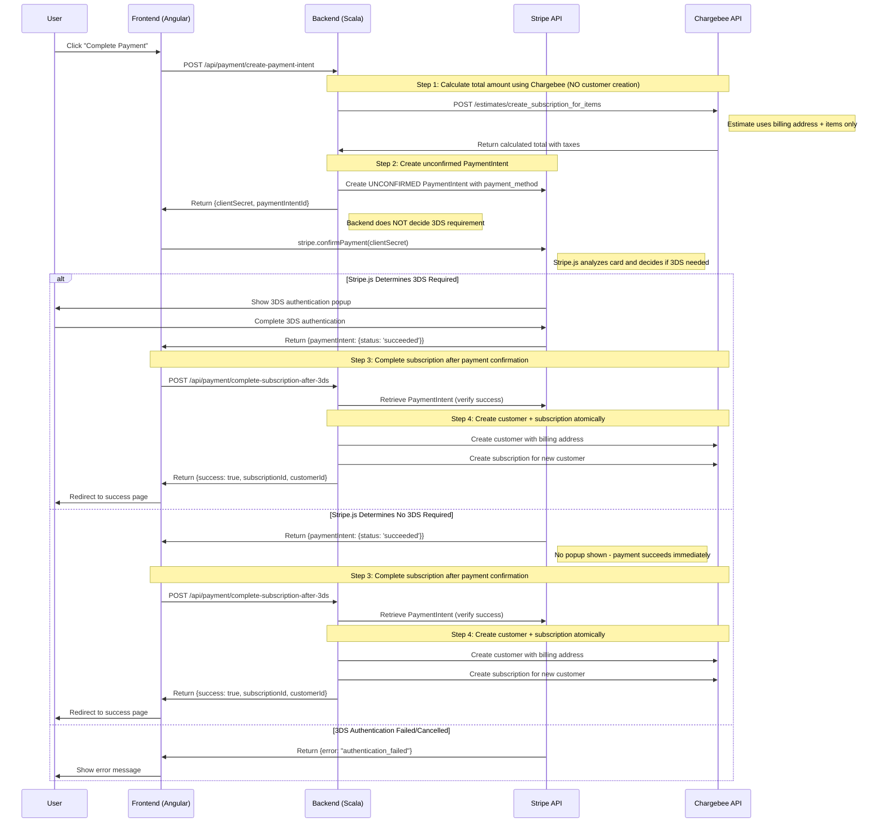

# Payment Flow Sequence Diagram

## Order Submission Flow with Stripe 3DS Integration

## Key Components Involved

### Frontend (Angular)
- **checkout-confirmation.component.ts**: Main orchestrator
- **stripe.service.ts**: Stripe.js integration wrapper
- **enhanced-cart-page.component.ts**: Payment method collection

### Backend (Scala)
- **CheckoutService**: Creates unconfirmed PaymentIntent, completes subscription after frontend confirmation
- **StripeClient**: Stripe API interactions with `confirm=false` parameter
- **PaymentRoutes**: REST API endpoints for payment flow

### External Services
- **Stripe**: Payment processing and 3DS authentication
- **Chargebee**: Subscription management

## Flow Decision Points

1. **Payment Method Collection**: User enters card details on cart page
2. **Direct Cost Estimation**: Backend estimates subscription cost using Chargebee **without creating customer**
3. **Amount Calculation**: Backend uses `/estimates/create_subscription_for_items` with billing address + items only
4. **Unconfirmed PaymentIntent Creation**: Backend creates PaymentIntent with calculated amount
5. **3DS Detection by Stripe.js**: Frontend calls `stripe.confirmPayment()` and **Stripe.js automatically determines** if 3DS is required based on:
   - Card issuer requirements
   - Payment amount and risk assessment
   - Regulatory requirements (PSD2, etc.)
6. **Authentication Branch**: 
   - **3DS Required**: Stripe.js shows popup → User completes → Backend creates customer + subscription
   - **No 3DS**: Stripe.js confirms immediately → Backend creates customer + subscription
7. **Atomic Resource Creation**: Backend creates customer and subscription **together** after payment success
8. **Success/Failure**: User sees appropriate outcome

## Key Architecture Decision: Who Decides 3DS?

**❌ Backend does NOT decide**: No logic in Scala code to determine 3DS requirement
**✅ Stripe.js decides automatically**: When `confirmPayment()` is called, Stripe's system:
- Analyzes the card type and issuer
- Checks regulatory requirements
- Determines risk factors
- Shows 3DS popup only if required
- Handles all 3DS complexity transparently

This follows Stripe's recommended best practices for 3DS handling.

## Key Optimization: Estimate Without Customer Creation

**❌ Old approach**: Create customer → Estimate → PaymentIntent → Complete subscription
**✅ New approach**: Estimate directly → PaymentIntent → Create customer + subscription together

**Benefits:**
- **Fewer API calls**: Eliminates unnecessary customer creation step
- **No orphaned customers**: Customer only created after successful payment
- **Simpler error handling**: No cleanup needed if payment fails
- **Better performance**: One less round-trip to Chargebee during checkout

**Chargebee API used:**
- `POST /estimates/create_subscription_for_items` - requires only billing address + items, no customer needed

## Error Handling Points

- Invalid payment method during PaymentIntent creation
- 3DS authentication failure or cancellation
- Stripe API errors during payment processing
- **Estimate API failures** (billing address validation, tax calculation issues)
- Chargebee customer creation failures (after successful payment)
- Chargebee subscription creation failures (after successful payment)
- Network timeouts or connection issues

**Improved Error Handling:**
- Payment failures no longer leave orphaned customers in Chargebee
- Estimate errors caught early before PaymentIntent creation
- Customer + subscription creation happens atomically after payment success

## Test Cards for Flow Validation

### **Credit Cards**
- **3DS Required**: `4000 0025 0000 3155`
- **No 3DS**: `4242 4242 4242 4242`
- **Declined**: `4000 0000 0000 0002`
