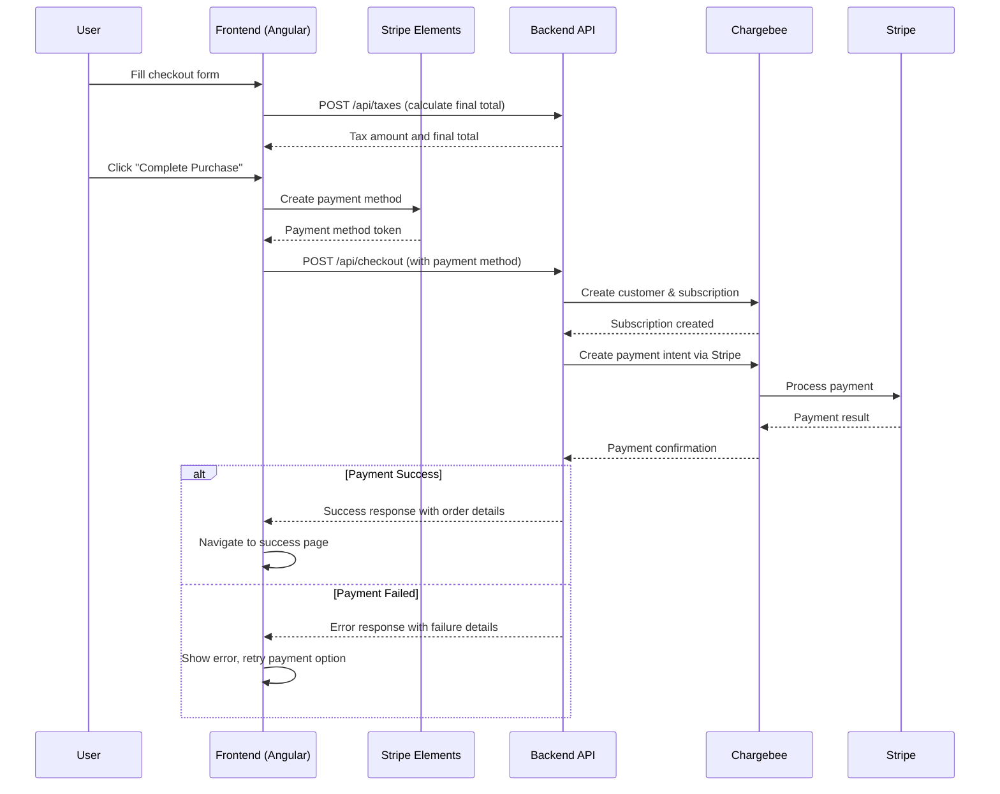

# Phase 3: Payment Processing Integration Planning

**Project:** Nitro Price Calculator - Chargebee Integration  
**Phase:** Payment Processing Integration (Phase 3)  
**Start Date:** June 11, 2025  
**Status:** Planning  

## 🎯 Phase 3 Objectives

### Primary Goal
Complete the payment processing integration to enable real 1-year subscription purchases through the Nitro Price Calculator, transforming it from a pricing tool to a fully functional e-commerce checkout experience.

### Success Criteria
- ✅ Secure payment collection via Stripe Elements
- ✅ Complete payment processing flow from cart to confirmation
- ✅ Robust error handling for payment failures and recovery
- ✅ Real-time subscription activation in Chargebee
- ✅ Professional success/failure user experience flows
- ✅ Webhook infrastructure for event monitoring

## 🏗️ Technical Architecture

### Payment Processing Flow


### Component Architecture
```
Frontend Payment Components:
├── checkout-page.component.ts (existing)
│   ├── Stripe Elements integration
│   ├── Payment method validation
│   └── Error handling & recovery
├── payment-success.component.ts (new)
│   ├── Order confirmation display
│   ├── Subscription details
│   └── Next steps guidance
├── payment-failure.component.ts (new)
│   ├── Failure reason display
│   ├── Retry payment option
│   └── Support contact information
└── payment.service.ts (new)
    ├── Stripe SDK wrapper
    ├── Payment method creation
    └── Payment status tracking

Backend Payment Services:
├── CheckoutService.scala (enhance)
│   ├── Stripe payment method handling
│   ├── Payment processing coordination
│   └── Subscription activation
├── StripeClient.scala (new)
│   ├── Payment method validation
│   ├── Payment intent creation
│   └── Error handling
└── WebhookService.scala (new)
    ├── Chargebee webhook processing
    ├── Stripe webhook processing
    └── Event logging and monitoring
```

## 🛠️ Implementation Plan

### Phase 3.1: Stripe Elements Integration (Week 1)
**Priority: Critical**

#### Frontend Tasks:
1. **Install Stripe Dependencies**
   ```bash
   npm install @stripe/stripe-js @stripe/stripe-angular
   ```

2. **Stripe Service Implementation**
   - Create `payment.service.ts` with Stripe SDK wrapper
   - Implement secure payment method creation
   - Add comprehensive error handling for Stripe errors

3. **Checkout Form Enhancement**
   - Integrate Stripe Elements card input fields
   - Add payment method validation
   - Implement secure tokenization flow
   - Add loading states and user feedback

4. **Environment Configuration**
   - Add Stripe publishable key to environment files
   - Configure test/production Stripe keys
   - Add payment processing feature flags

#### Backend Tasks:
1. **Stripe Client Implementation**
   - Create `StripeClient.scala` with payment processing logic
   - Add payment method validation and confirmation
   - Implement error handling for payment failures

2. **Enhanced Checkout Service**
   - Update `CheckoutService` to handle payment methods
   - Integrate with Chargebee-Stripe payment processing
   - Add payment confirmation and subscription activation

### Phase 3.2: Success/Failure User Experience (Week 2)
**Priority: High**

#### Success Flow:
1. **Payment Success Component**
   - Create order confirmation page
   - Display subscription details and billing information
   - Show payment receipt and confirmation number
   - Add next steps and account access instructions

2. **Order Details Display**
   - Comprehensive order summary
   - Subscription start date and billing cycle
   - Customer service contact information
   - Download/access instructions for purchased products

#### Failure Flow:
1. **Payment Failure Component**
   - Clear error messaging for different failure reasons
   - Retry payment option with preserved form data
   - Alternative payment method suggestions
   - Support escalation and contact information

2. **Error Recovery**
   - Preserve customer information on payment failure
   - Allow payment method changes and retry
   - Implement smart retry logic for transient failures
   - Add comprehensive error logging for debugging

### Phase 3.3: Webhook Infrastructure (Week 3)
**Priority: Medium**

#### Webhook Endpoints:
1. **Chargebee Webhooks**
   - `POST /api/webhooks/chargebee` endpoint
   - Subscription event processing (created, changed, cancelled)
   - Payment event processing (succeeded, failed, refunded)
   - Customer event processing (created, updated)

2. **Stripe Webhooks**
   - `POST /api/webhooks/stripe` endpoint
   - Payment intent event processing
   - Payment method event processing
   - Webhook signature verification

3. **Event Processing**
   - Event logging and monitoring
   - Error handling and retry logic
   - Idempotency for duplicate events
   - Real-time notification system

## 🧪 Testing Strategy

### Payment Flow Testing
1. **Successful Payment Scenarios**
   - Valid credit cards (test cards from Stripe)
   - Multiple currencies and payment amounts
   - Different customer information combinations
   - End-to-end subscription creation validation

2. **Payment Failure Scenarios**
   - Declined cards (insufficient funds, invalid card, etc.)
   - Network failures and timeout handling
   - Stripe service unavailability
   - Chargebee subscription creation failures

3. **User Experience Testing**
   - Form validation and error messaging
   - Loading states and progress indicators
   - Mobile payment experience
   - Cross-browser compatibility

### Integration Testing
1. **Chargebee Integration**
   - Subscription creation and activation
   - Customer data synchronization
   - Payment method storage and processing
   - Billing cycle and invoicing

2. **Stripe Integration**
   - Payment method tokenization
   - Payment processing and confirmation
   - Error handling and retry logic
   - Webhook event processing

## 🔐 Security Considerations

### Payment Security
- **PCI Compliance**: Stripe Elements ensure PCI compliance
- **No Card Storage**: No sensitive payment data stored in frontend/backend
- **Secure Tokenization**: All payment methods tokenized via Stripe
- **SSL/TLS**: All payment communications over HTTPS

### Webhook Security
- **Signature Verification**: Verify all webhook signatures
- **Idempotency**: Handle duplicate webhook deliveries
- **Rate Limiting**: Implement webhook rate limiting
- **Error Handling**: Secure error responses

### Data Protection
- **Customer Data**: Secure storage in Chargebee
- **Payment Data**: Stored securely in Stripe
- **Audit Logging**: Comprehensive audit trail
- **Access Control**: Restricted access to payment data

## 📊 Success Metrics

### Technical Metrics
- **Payment Success Rate**: Target >95% for valid payment methods
- **Error Recovery Rate**: Target >80% of failed payments recovered
- **Page Load Performance**: Checkout page <2s load time
- **Mobile Compatibility**: 100% feature parity on mobile

### Business Metrics
- **Conversion Rate**: Measure checkout completion rate
- **Customer Acquisition**: Track new subscription creation
- **Payment Method Distribution**: Monitor preferred payment methods
- **Error Analysis**: Track and resolve common payment issues

### User Experience Metrics
- **Checkout Time**: Average time from cart to completion
- **Error Recovery**: Time to resolve payment failures
- **Customer Satisfaction**: Post-purchase feedback scores
- **Support Escalation**: Reduction in payment-related support tickets

## 🚀 Deployment Strategy

### Phase 3.1 Deployment (Stripe Integration)
1. **Development Environment Testing**
2. **Staging Environment Validation**
3. **Feature Flag Rollout**
4. **Production Deployment**
5. **Monitoring and Rollback Plan**

### Phase 3.2 Deployment (UX Components)
1. **Component Testing**
2. **Integration Testing**
3. **User Acceptance Testing**
4. **Production Release**

### Phase 3.3 Deployment (Webhooks)
1. **Webhook Endpoint Deployment**
2. **External Service Configuration**
3. **Event Processing Testing**
4. **Monitoring and Alerting Setup**

## 🔮 Future Enhancements (Phase 4)

### Advanced Payment Features
- Apple Pay and Google Pay integration
- Bank transfer and ACH payments
- Subscription upgrade/downgrade flows
- Promotional codes and discounts

### Analytics and Monitoring
- Payment analytics dashboard
- Conversion funnel analysis
- A/B testing for checkout flow
- Real-time payment monitoring

### Customer Experience
- Saved payment methods
- Auto-billing and renewal notifications
- Self-service subscription management
- Payment history and receipts

---

**Next Steps**: Begin Phase 3.1 implementation with Stripe Elements integration.
