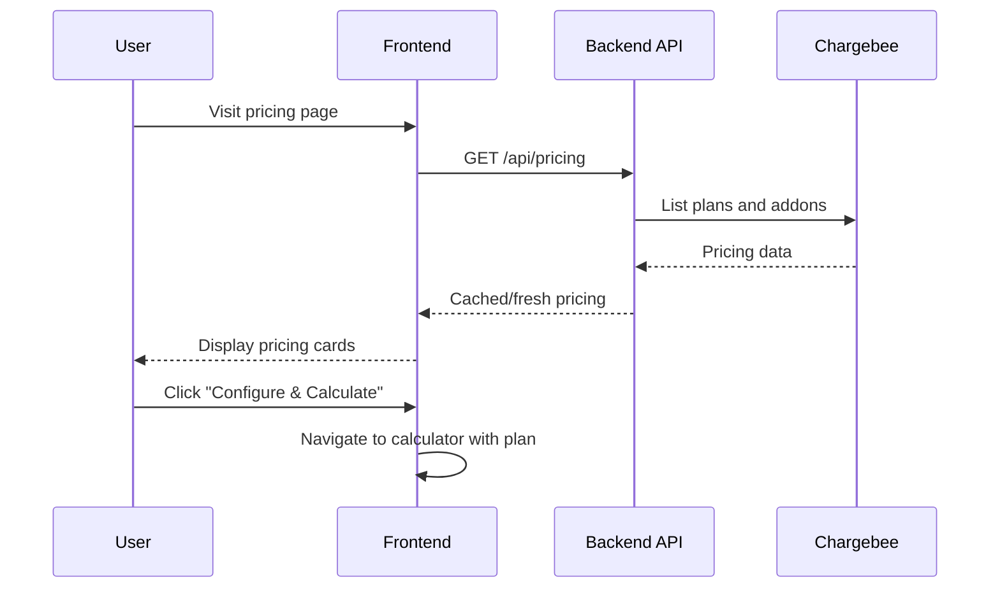
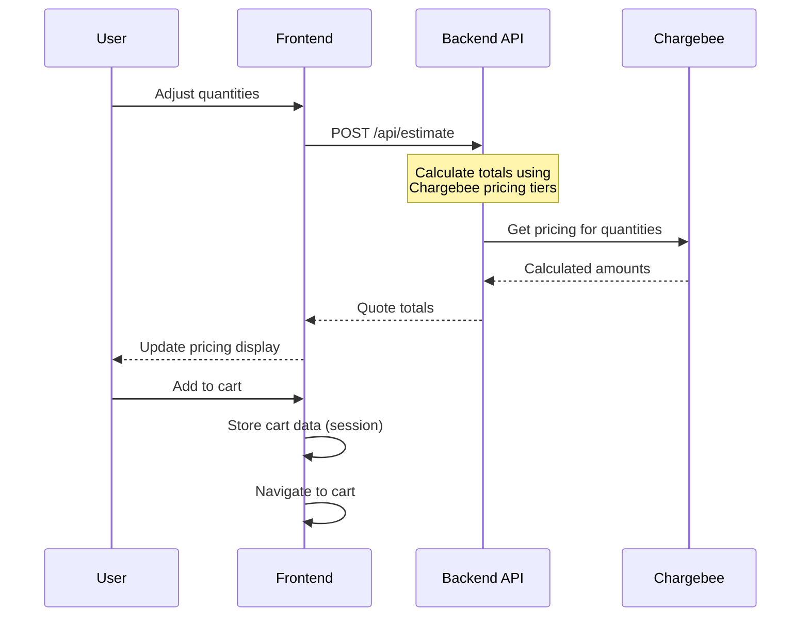
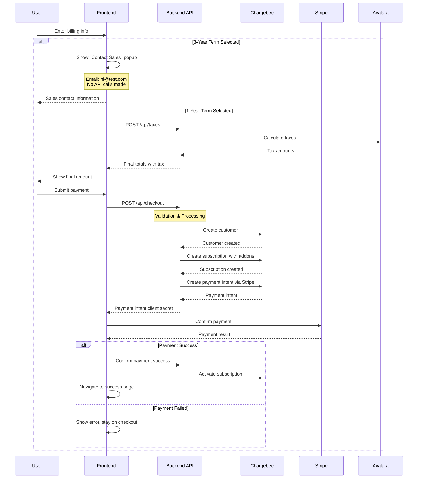
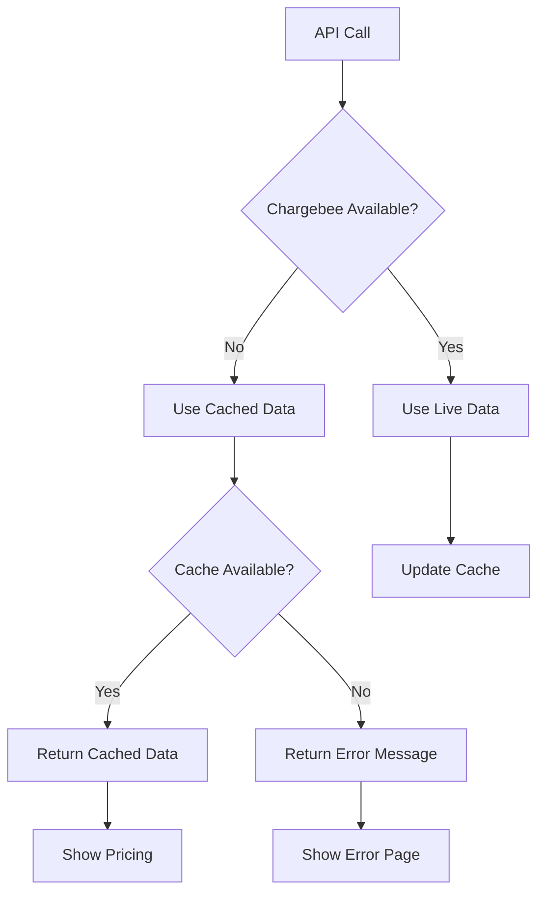

# Nitro Price Calculator - Chargebee Integration Planning

## Project Overview

### Purpose
Transform the current static price calculator into a fully integrated billing solution using Chargebee for subscription management, Stripe for payments, and Avalara for tax calculation.

### Goals
- Replace static pricing data with real-time Chargebee integration
- Implement complete checkout flow with payment processing
- Provide accurate tax calculation for global customers
- Maintain current UX while adding robust backend functionality

### Current State
- Static Angular pricing calculator with three pages (Pricing, Calculator, Cart)
- Mock data from `pricing-data.json`
- Nitro theme implemented across all components

### Target State
- Dynamic pricing from Chargebee APIs
- Functional checkout with Stripe payment processing
- Tax calculation via Avalara
- Customer and subscription creation in Chargebee

## Technical Architecture

### Tech Stack
**Frontend:** Angular (existing)
**Backend:** Scala with Pekko-HTTP and Cats
**Billing:** Chargebee
**Payments:** Stripe
**Taxes:** Avalara
**Deployment:** Heroku

### System Architecture

```mermaid
graph TB
    subgraph "Frontend (Angular)"
        A[Pricing Page] --> B[Calculator Page]
        B --> C[Cart Page]
        C --> D[Checkout Page]
        D --> E[Success Page]
    end
    
    subgraph "Backend API (Scala/Pekko)"
        F[/api/pricing]
        G[/api/estimate]
        H[/api/checkout]
        I[/api/taxes]
        J[/api/webhooks/chargebee]
        K[/api/chargebee/discovery]
    end
    
    subgraph "Data Sources"
        L[Chargebee - 1 Year Pricing]
        P[pricing-data.json - 3 Year Pricing]
    end
    
    subgraph "External Services"
        M[Stripe]
        N[Avalara/Mock Tax]
    end
    
    A --> F
    B --> F
    B --> G
    C --> G
    D --> H
    D --> I
    
    F --> L
    F --> P
    G --> L
    G --> P
    H --> L
    H --> M
    I --> N
    K --> L
    
    L -.->|Webhooks| J
    M -.->|Webhooks| J
```

## Chargebee Setup

### Configuration Strategy

**1-Year Pricing Plans:**
- Configure products/plans in Chargebee for 1-year terms only
- Use Chargebee APIs to retrieve dynamic pricing and tier breakpoints
- Handle different user tiers and addon pricing through Chargebee configuration
- we use product catalogue v2.0 in chargebee

**3-Year Pricing Plans:**
- **NOT configured in Chargebee** - continue using existing `pricing-data.json`
- Hybrid approach: backend serves static 3-year pricing from configuration file
- Checkout flow for 3-year plans redirects to sales contact instead of payment processing
- No subscription creation or payment processing for 3-year terms

### Products Structure ✅ **DISCOVERED & CONFIGURED**
**📋 Current Chargebee Configuration (from nitro-ubb-test site)**

#### **Product Catalog 2.0 Structure** 🔑 **FULLY IMPLEMENTED**
Based on successful discovery and testing, the Chargebee structure uses PC 2.0 with volume-based pricing:
- **Subscription Container**: `Chargebee_susbcription_plan` ($0) - serves as the base subscription
- **Product Selection Items**: Products represented as items with volume-based pricing
- **Product Selection Addons**: Additional features as addon items

#### **Subscription Container (1 Item - $0)**
- `Chargebee_susbcription_plan` - "Chargebee Subscription plan" ($0 yearly)
  - **Purpose**: Base subscription container for all customers
  - **Usage**: Every customer subscribes to this + adds products via item prices

#### **Product Selection Items (5 Items)** 
These represent product choices with volume-based pricing configured:
- `Nitro_SIGN_ENT` - "Nitro Sign Enterprise" (✅ Volume pricing configured)
- `Nitro_SIGN_PLUS` - "Nitro Sign Plus" (✅ Volume pricing configured)
- `Nitro_SIGN_STD` - "Nitro Sign Standard" (✅ Volume pricing configured)
- `Nitro_PDF_PLUS` - "Nitro PDF Plus" (✅ Volume pricing configured)
- `Nitro_PDF_STD` - "Nitro PDF Standard" (✅ Volume pricing configured)

#### **Product Selection Addons (2 Items)**
Additional features with volume-based pricing:
- `sign-packages` - "sign-packages" (✅ Volume pricing configured for all Sign plans)
- `sign-api` - "sign-api" (✅ Volume pricing configured for Sign Enterprise only) 


### Business Rules ✅ **IMPLEMENTED & TESTED**
- ✅ **Product Catalog 2.0 Structure**: 
  - Successfully using PC 2.0 APIs with correct item and item_price models
  - All products configured as items with volume-based pricing tiers
- ✅ **Discovery Endpoint**: 
  - `GET /api/chargebee/discovery` successfully returns 8 items and 40 item prices
  - All volume tiers and currency support validated through testing
- ✅ **Volume-Based Pricing Configured**: 
  - All 7 product items have volume-based pricing across 5 currencies (USD, EUR, GBP, CAD, AUD)
  - Different tier breakpoints per item (4 tiers for sign-api, 4 tiers for sign-packages)
- ✅ **Multi-currency Support**: USD, EUR, GBP, CAD, AUD all configured and tested
- **Billing Terms**: 1-year automated (Chargebee), 3-year sales-assisted (static pricing)
- **3-Year Checkout Flow**: Show "Contact Sales" popup instead of payment processing  
- **Pricing Data Sources**: 1-year from Chargebee APIs, 3-year from pricing-data.json

### Webhook Events
The system will monitor and log the following Chargebee events:
- **Subscription Events**: `subscription_created`, `subscription_changed`, `subscription_cancelled`, `subscription_reactivated`
- **Payment Events**: `payment_succeeded`, `payment_failed`, `payment_refunded`
- **Customer Events**: `customer_created`, `customer_changed`

#### Webhook Monitoring Requirements
- **Logging Details**: Log customer_id, subscription_id, event_type, timestamp, and key event data
- **Error Handling**: Proper HTTP response codes (200 for success, 4xx/5xx for errors)
- **Idempotency**: Handle duplicate webhook deliveries gracefully
- **Monitoring**: Track webhook delivery failures and retry mechanisms

### Supported Currencies
- USD, EUR, AUD, CAD, GBP

## Application Flow Diagrams

### 1. Pricing Page Flow


### 2. Calculator Flow


### 3. Checkout Flow


### 4. Error Handling Flow


## Data Models

### Quote Estimation Request
```json
{
  "items": [
    {
      "addon_id": "Nitro_PDF_PLUS",
      "quantity": 50
    }
  ],
  "currency": "USD",
  "billing_cycles": 1
}
```

### Checkout Request
```json
{
  "customer": {
    "email": "user@company.com",
    "company": "Acme Corp",
    "billing_address": {
      "line1": "123 Main St",
      "city": "San Francisco",
      "state": "CA",
      "zip": "94105",
      "country": "US"
    }
  },
  "subscription": {
    "plan_id": "Chargebee_susbcription_plan",
    "billing_cycles": 1,
    "addons": [
      {
        "id": "Nitro_PDF_PLUS",
        "quantity": 50
      }
    ]
  }
}
```
**Note**: Only 1-year terms supported for automated checkout. 3-year terms redirect to sales.

## API Endpoints

### GET /api/pricing
**Purpose:** Fetch current pricing from Chargebee (1-year) and static data (3-year)
**Response:** Combined pricing data for all addons with tier information
**Caching:** 1-year pricing cached for 1 hour, 3-year pricing from static file
**Data Sources:** Chargebee API for 1-year terms, pricing-data.json for 3-year terms

### POST /api/estimate
**Purpose:** Calculate quote totals for given quantities and terms
**Request:** List of addon IDs, quantities, and billing term (1-year or 3-year)
**Response:** Subtotals, discounts, total before tax
**Data Sources:** Chargebee API for 1-year calculations, pricing-data.json for 3-year calculations

### POST /api/taxes
**Purpose:** Calculate taxes using Avalara
**Request:** Customer address and line items
**Response:** Tax amounts by jurisdiction

### POST /api/checkout
**Purpose:** Create customer, subscription, and process payment (1-year terms only)
**Request:** Customer info, cart items, payment details
**Response:** Payment intent or success confirmation
**Validation:** Reject 3-year terms with error directing to sales contact

## Security & Compliance

### Environment Variables
- Separate keys for test/production environments
- Chargebee API keys
- Stripe publishable/secret keys
- Avalara credentials

### Data Protection
- No sensitive data stored in frontend
- Payment processing via Stripe (PCI compliant)
- Customer data stored in Chargebee

### Error Handling
- Graceful fallbacks to cached data
- User-friendly error messages
- No sensitive information exposed in errors

## Performance Considerations

### Caching Strategy
- Pricing data cached for 1 hour
- Quote calculations cached for session duration
- Fallback to cached data on API failures

### Loading States
- Show spinners during API calls
- Progressive enhancement for better UX
- Offline capability with cached data

## Future Enhancements (Out of Scope)

### Phase 2 Features
- Monthly and 3-year billing terms
- Free trial functionality
- Promotional codes and discounts
- PDF quote generation
- Quote sharing capabilities

### Phase 3 Features
- Webhook handling for subscription events
- Admin interface for pricing management
- Advanced tax exempt customer handling
- Address validation with Avalara
- 3D Secure authentication
- CRM/sales tool integration
- Analytics and reporting
- SSO integration

## Constraints & Assumptions

### Technical Constraints
- Angular frontend must remain unchanged in structure
- Scala backend required (not Node.js)
- Heroku deployment platform
- Chargebee addon model (not multiple plans)

### Business Constraints
- **Billing Terms**: 1-year automated checkout, 3-year sales-assisted only
- No customer creation until payment
- Single PDF and Sign addon per subscription
- Global pricing (no regional variations initially)
- **3-Year Pricing Flow**: Display pricing and estimates normally, redirect to sales for checkout

### Assumptions
- Chargebee addons are properly configured with volume tiers
- Stripe account supports all required currencies
- Avalara account has necessary tax jurisdictions enabled
- Users will complete purchase in single session (no cart persistence)
