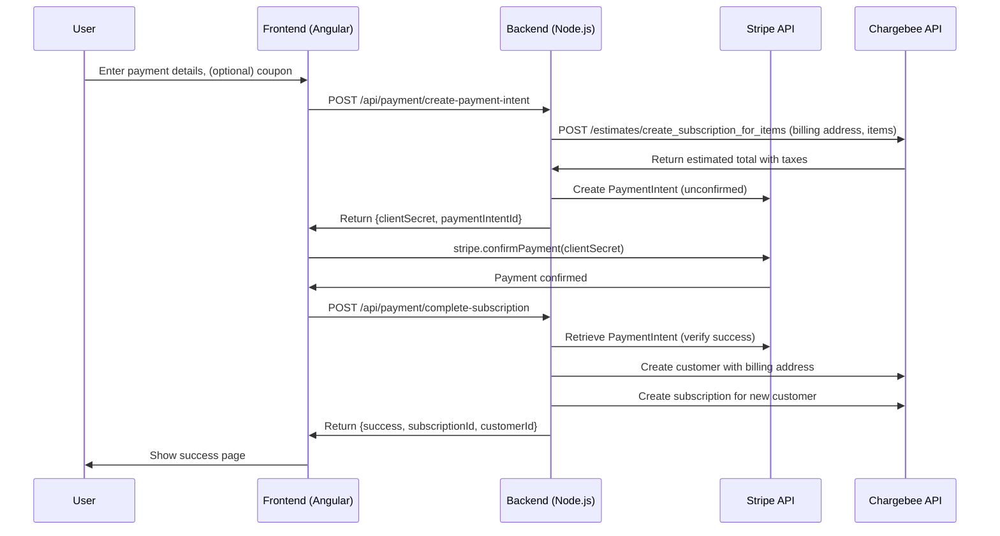
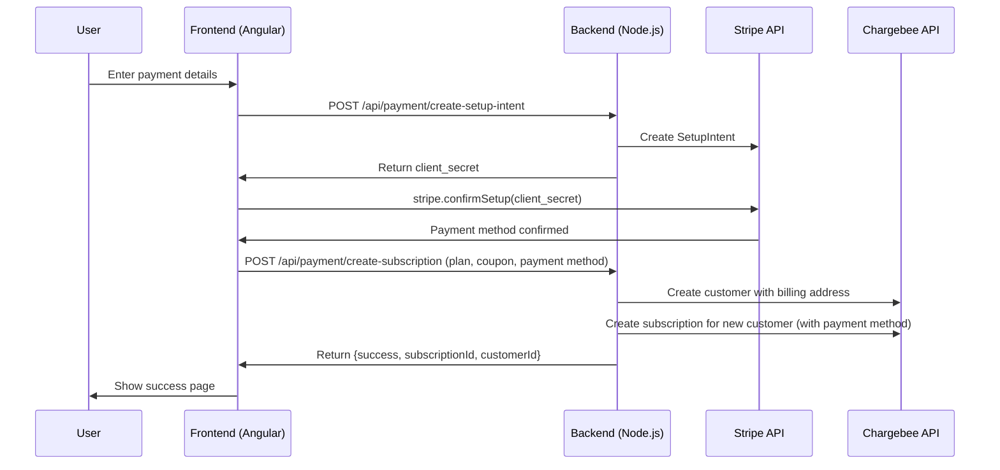

# Simplified Chargebee-Backed Subscription Payment Flows (No 3DS)

This document presents simplified sequence diagrams for subscription payment flows using a Chargebee-backed architecture, omitting 3DS authentication complexity but retaining frontend PaymentIntent confirmation. For the full, canonical flow (including 3DS), see:

[Order Submission Flow with Stripe 3DS Integration](PAYMENT_FLOW_SEQUENCE_DIAGRAM.md#order-submission-flow-with-stripe-3ds-integration)

---

## 1. Standard Flow: Estimate, PaymentIntent, Then Subscription Creation (Recommended)

---

## 2. Alternative Flow: Take Payment Method First, Then Create Subscription *(Untested)*

---

These diagrams show the core payment and subscription creation steps for a Chargebee-backed system, with PaymentIntent confirmation handled on the frontend. For full details and 3DS handling, see the canonical diagram in PAYMENT_FLOW_SEQUENCE_DIAGRAM.md.
