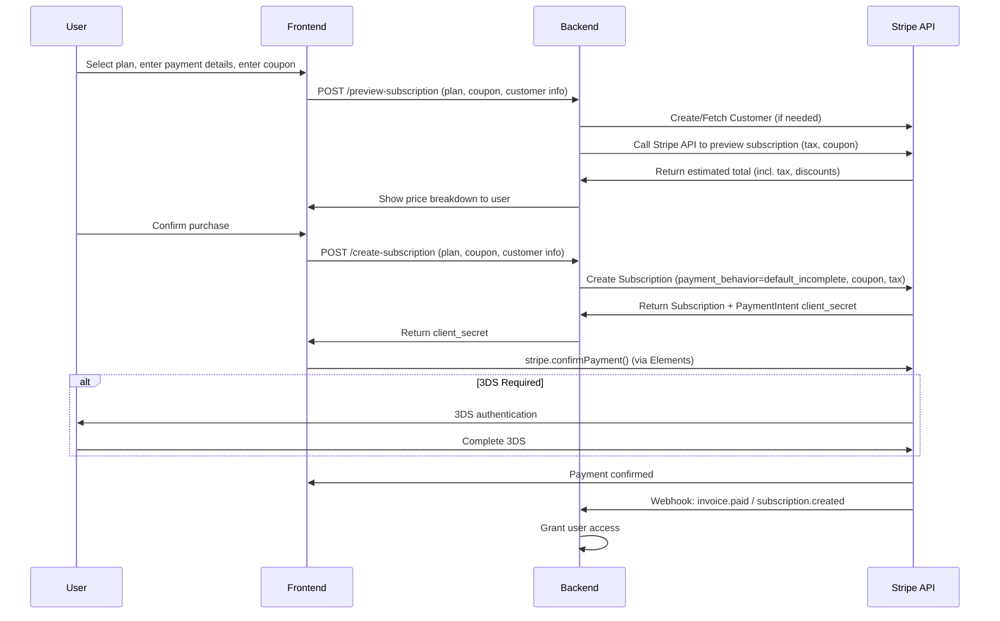
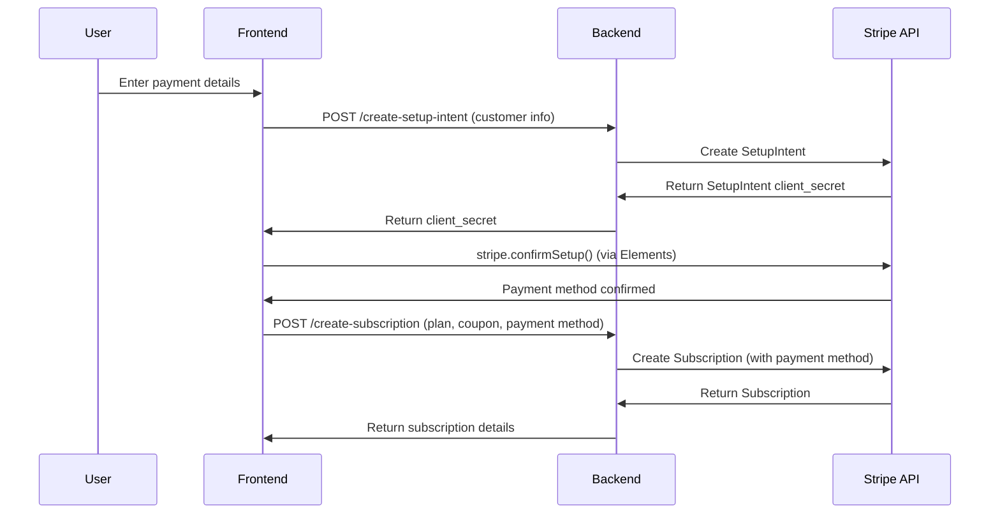

---

# Stripe Billing + Elements: Subscription Flow with Tax & Coupons

This document illustrates two recommended subscription payment flows using Stripe Billing and Stripe Elements, including tax estimation and coupon handling, as recommended in the [Stripe documentation](https://docs.stripe.com/billing/subscriptions/build-subscriptions?platform=web&ui=elements).

---
---

## Note on Incomplete Subscription Cleanup

When using `payment_behavior=default_incomplete`, subscriptions that are never confirmed (i.e., the user abandons checkout or payment fails) will remain in an incomplete state. It is your responsibility to periodically clean up these abandoned subscriptions to avoid clutter and potential billing confusion.

Stripe recommends:
- Monitoring for subscriptions that remain incomplete for too long (e.g., several hours or days)
- Canceling or deleting them as appropriate, either via scheduled jobs or webhook handling

For more details, see:
- [Stripe: Incomplete Subscriptions](https://docs.stripe.com/billing/subscriptions/overview#subscription-statuses)
- [Stripe: Cleaning Up Incomplete Subscriptions](https://docs.stripe.com/billing/subscriptions/build-subscriptions?platform=web&ui=elements#handling-incomplete-subscriptions)

---

## Additional Note: Payment Method Flexibility

When the backend creates the subscription (with `payment_behavior=default_incomplete`), the initial PaymentIntent is generated in a `requires_payment_method` state. The user can then provide any valid payment method supported by your Stripe account at the point of confirmation using Stripe Elements. This allows for maximum flexibility, as the payment method is not fixed until the user completes checkout.

## 1. Standard Flow: Subscription Created First (Recommended)

**High-Level Flow Overview:**

- User selects a plan, enters payment details, and (optionally) a coupon code.
- Frontend requests a subscription preview from the backend, which calls Stripe to estimate the total price (including tax and discounts).
- User is shown the final price breakdown before confirming payment.
- On confirmation, the backend creates the subscription in `default_incomplete` state, and returns the PaymentIntent client secret.
- Frontend uses Stripe Elements to collect and confirm payment, including 3DS if required.
- Stripe webhooks notify the backend when payment is complete, and access is provisioned.

**Sequence Diagram (Standard Flow):**

---

## 2. Alternative Flow: Take Payment Before Creating Subscription

In some cases, you may want to collect and confirm the user's payment method before creating the subscription. This can help ensure the payment method is valid and avoid incomplete subscriptions. The typical steps are:

1. Collect and confirm the payment method using a SetupIntent or PaymentIntent.
2. Attach the confirmed payment method to the customer.
3. Create the subscription with the saved payment method.

This approach is useful if you want to guarantee a valid payment method before provisioning a subscription, or to avoid abandoned/incomplete subscriptions.

**Sequence Diagram (Alternative Flow):**

For more details, see: [Stripe: Collect payment method before creating a subscription](https://docs.stripe.com/billing/subscriptions/build-subscriptions?platform=web&ui=elements#collect-payment-method-before-creating-subscription)

---

---

## 1. Standard Flow: Subscription Created First (Recommended)

**High-Level Flow Overview:**

- User selects a plan, enters payment details, and (optionally) a coupon code.
- Frontend requests a subscription preview from the backend, which calls Stripe to estimate the total price (including tax and discounts).
- User is shown the final price breakdown before confirming payment.
- On confirmation, the backend creates the subscription in `default_incomplete` state, and returns the PaymentIntent client secret.
- Frontend uses Stripe Elements to collect and confirm payment, including 3DS if required.
- Stripe webhooks notify the backend when payment is complete, and access is provisioned.

**Sequence Diagram (Standard Flow):**

---

## 2. Alternative Flow: Take Payment Before Creating Subscription

In some cases, you may want to collect and confirm the user's payment method before creating the subscription. This can help ensure the payment method is valid and avoid incomplete subscriptions. The typical steps are:

1. Collect and confirm the payment method using a SetupIntent or PaymentIntent.
2. Attach the confirmed payment method to the customer.
3. Create the subscription with the saved payment method.

This approach is useful if you want to guarantee a valid payment method before provisioning a subscription, or to avoid abandoned/incomplete subscriptions.

**Sequence Diagram (Alternative Flow):**

For more details, see: [Stripe: Collect payment method before creating a subscription](https://docs.stripe.com/billing/subscriptions/build-subscriptions?platform=web&ui=elements#collect-payment-method-before-creating-subscription)

---

## Key Points

- Tax and coupon discounts are estimated before payment, ensuring transparency for the customer.
- Stripe Elements is used for secure, PCI-compliant payment collection and 3DS authentication.
- The backend is responsible for all Stripe API calls and webhook handling.
- Both flows are supported by Stripe, but the standard flow is recommended for most SaaS and subscription products.
